# mermaid 실 습 
-순서도 실습
    -첫번째 샘플

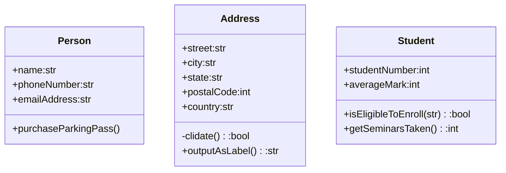

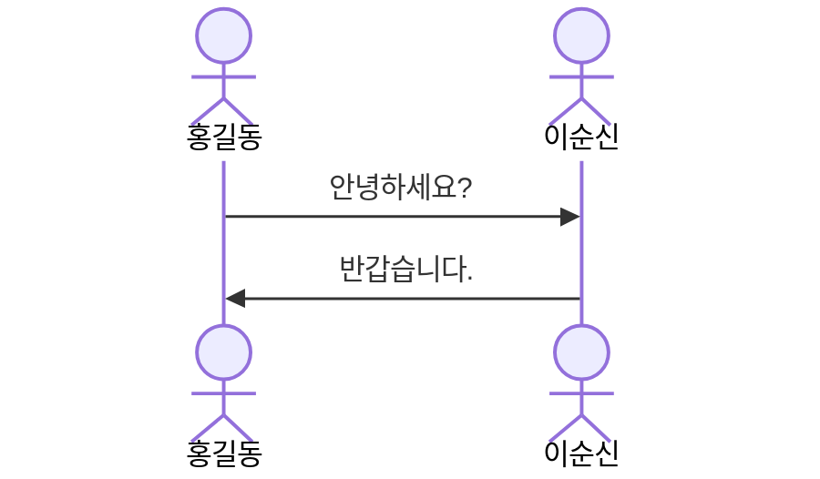

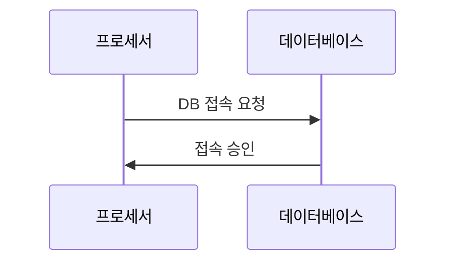

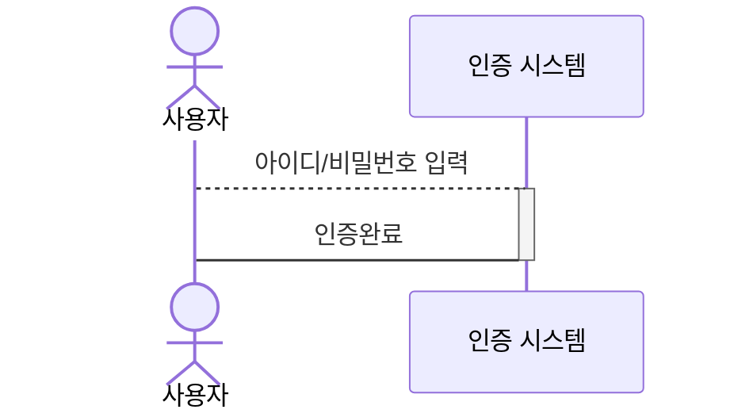

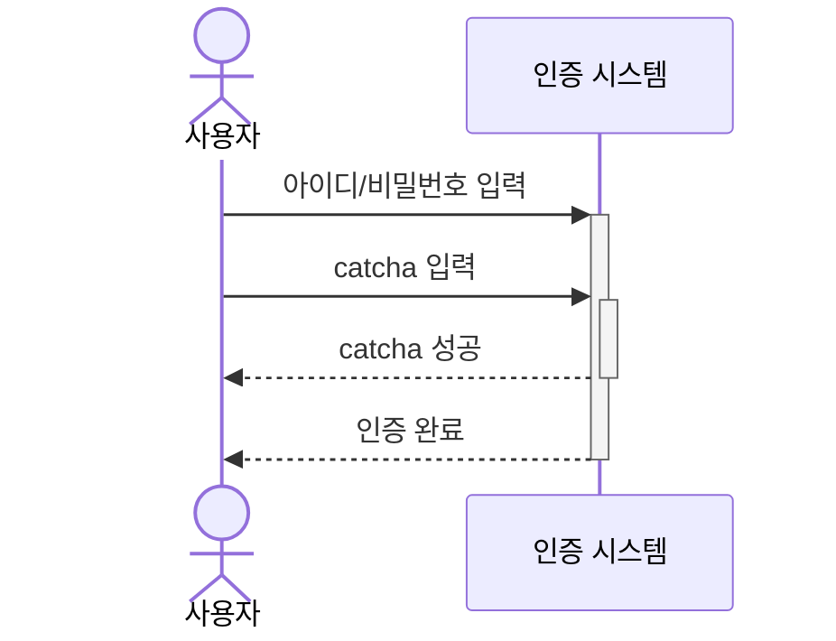

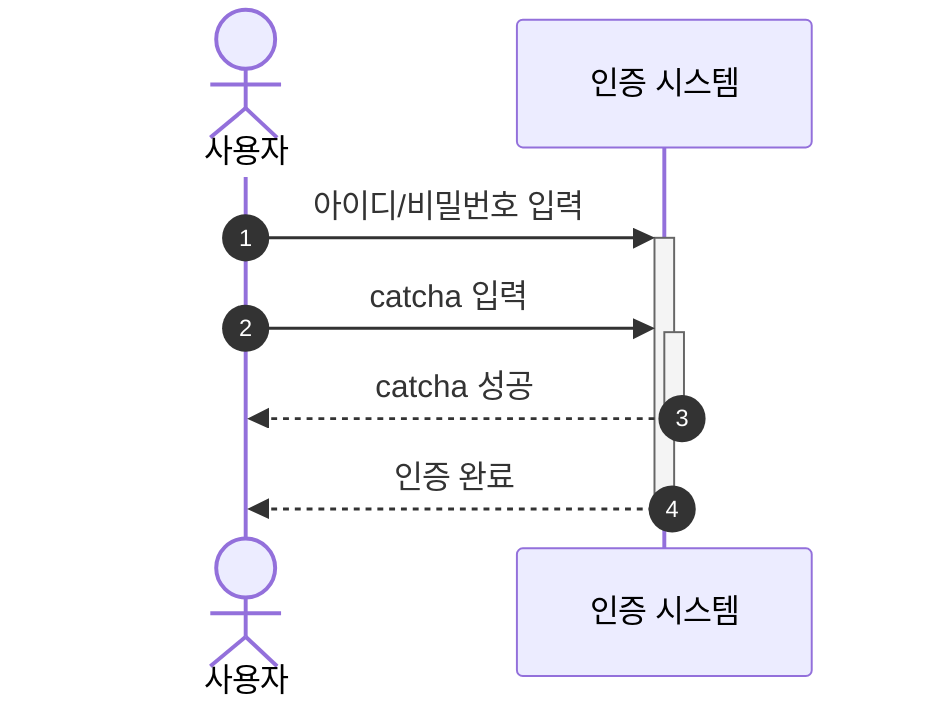

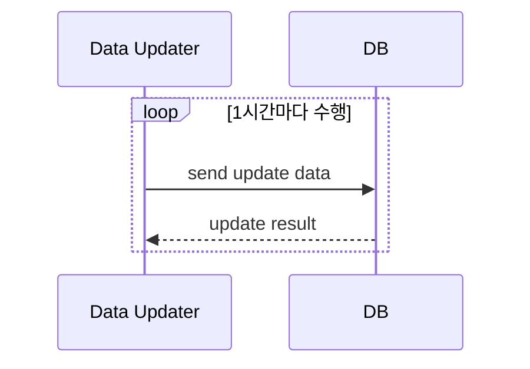

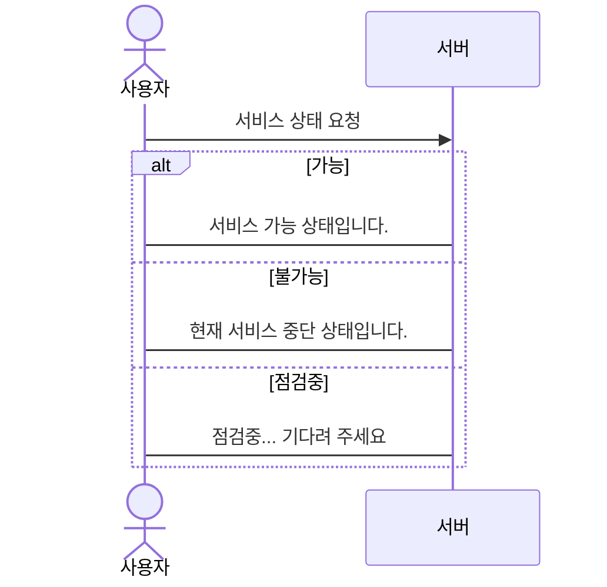

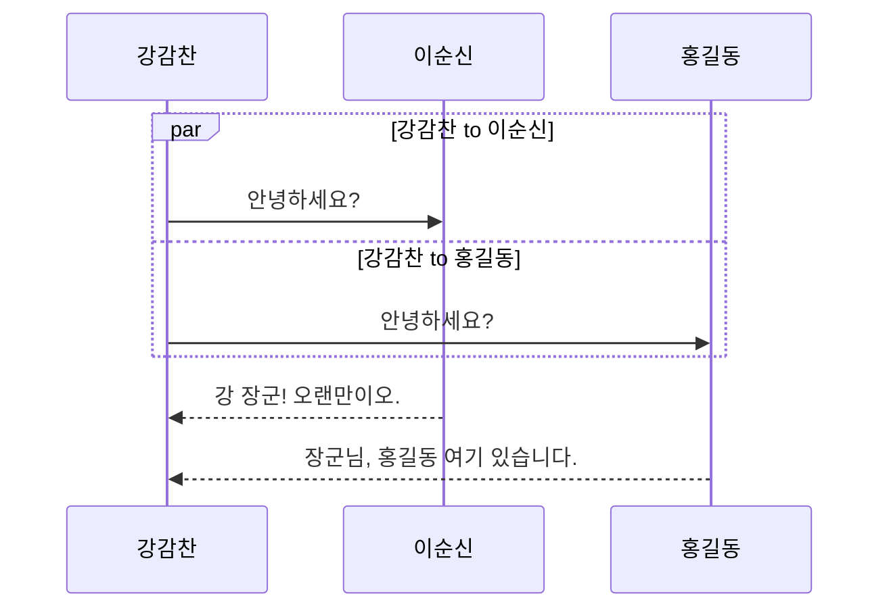

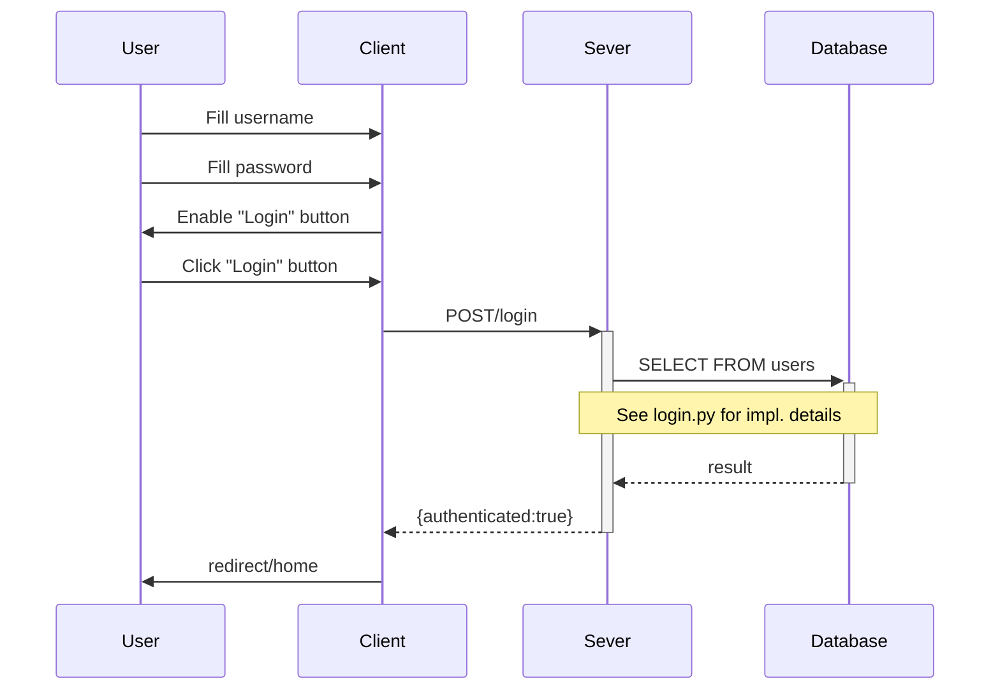

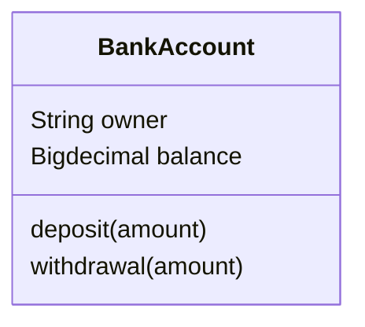

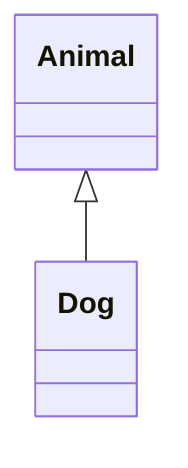

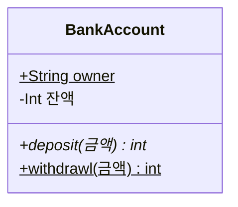

```{mermaid}
classDiagram 
    classA <|-- classB
    classC *-- classD
    classE o-- classF
    classG <-- classH
    classI <.. classJ
    classK <|.. classL
    classM -- classN
    classO .. classP
```

```{mermaid}
classDiagram
    Course "1..*" <-- "1" Student  
```

```{mermaid}
classDiagram
    class Color{
        <<enumberation>>
        RED
        GREEN
        BLUE
        WHITE
        BLACK
    }
```


```mermaid
ClassDiagram 
    class
        Person: +name:str
        Person: +phoneNumber:str
        Person: +emailAddress:str
        Person: +purchaseParkingPass()
```  


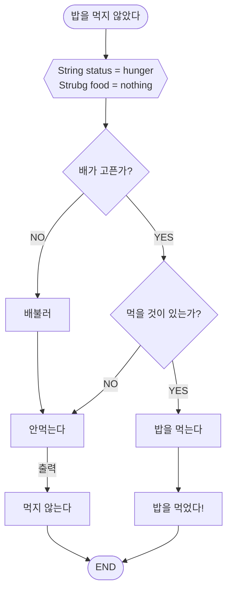


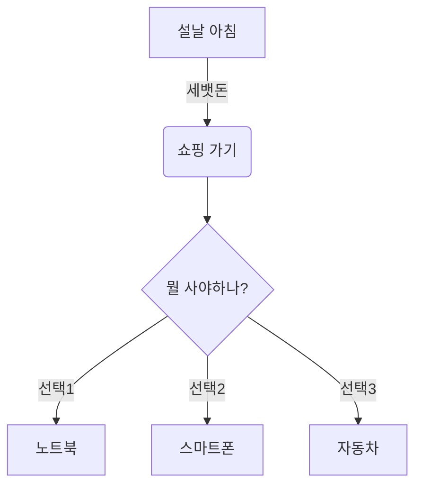
## 여기는 수업 끝 입니다
    